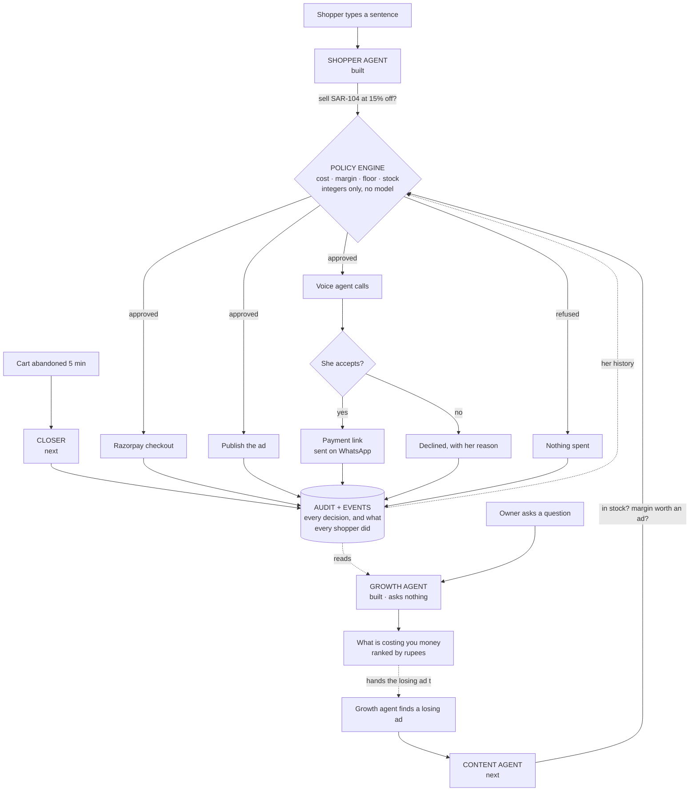
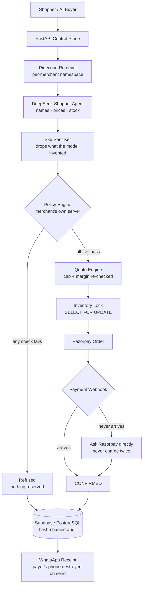
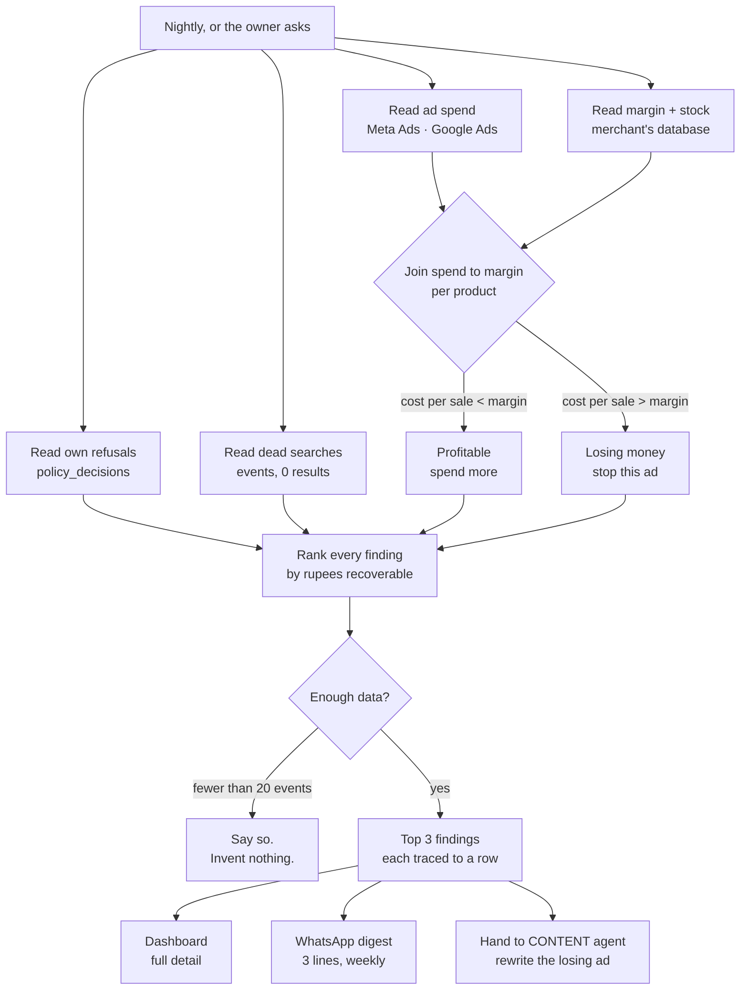
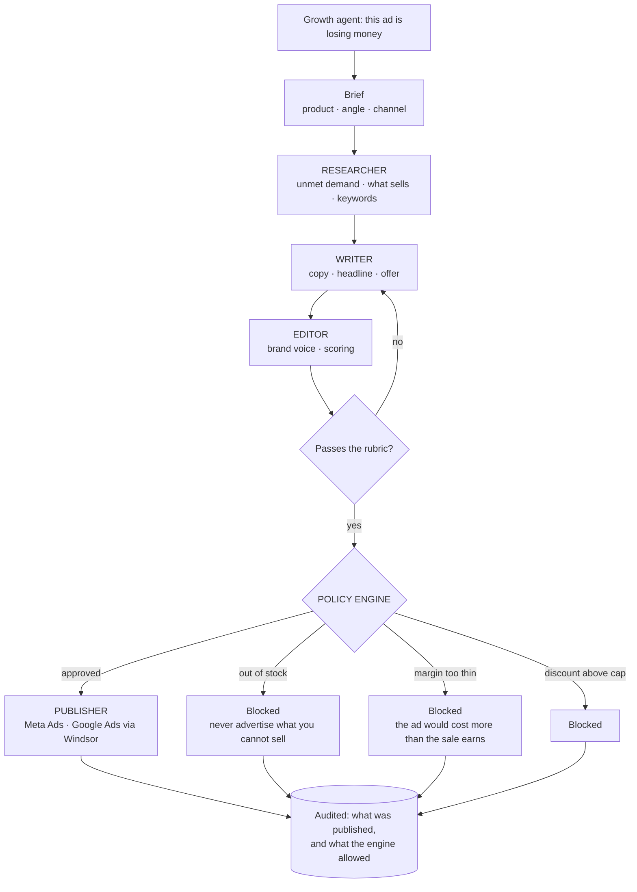
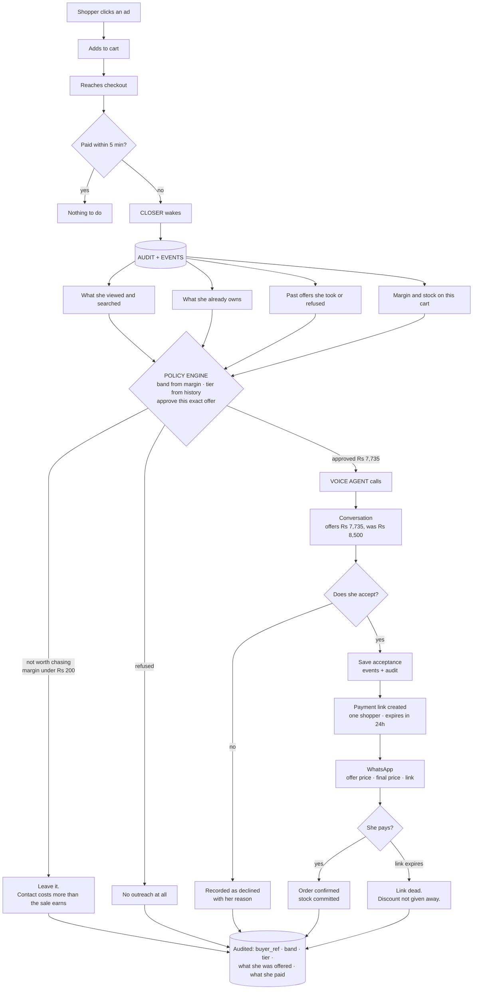

# Merchant Agent Commerce Control Plane

Razorpay moves the money. This service decides how a merchant safely sells.

An AI buyer can negotiate with a merchant here. It cannot negotiate away the
merchant's economics, and it cannot cause a customer to be charged twice.

Built for the Razorpay AI Buildathon, Track 01 — AI Growth & Agentic Commerce.

- Live: **commerce-control-plane-api.vercel.app**
- 212 tests
- 12 migrations

---

## The idea in one paragraph

A language model proposes what to sell. A deterministic policy engine decides
whether that proposal is allowed. A quote engine calculates the price from the
database, never from anything the model or a product description said. Stock is
held under a row lock with a timeout. Razorpay takes the payment. When the
payment webhook goes missing — which it does — the system records that it does
not know what happened, asks Razorpay directly, and never charges again.

The model is a good salesperson and a terrible accountant. This system lets it
be the first and never the second.

---

## The system

The shopper and content agents ask the gate directly. The closer asks through
her history — what she viewed, owns and previously refused is what the gate
prices against. Growth asks nothing at all: it proposes no price, so it only
*reads* what the gate already decided.



| Agent | Reads | Asks the gate | Built |
|---|---|---|---|
| **Shopper** | catalog names, prices, stock | yes | yes |
| **Growth** | the audit, ad spend, margin | **no** — proposes no price | yes |
| **Content** | brand voice, what sells | yes, before publishing | next |
| **Closer** | her history, then margin | yes, through that history | next |

## What runs where

The split is the design. It is not a deployment detail.

```
  MERCHANT'S SERVER                 THIS SERVICE
  ┌───────────────────┐             ┌──────────────────────┐
  │ their storefront  │             │ search index         │
  │                   │──search────▶│   names, prices only │
  │ commerce-policy   │             │                      │
  │   the engine      │◀──proposal──│ the agents           │
  │   reads cost      │             │   propose, never     │
  │                   │             │   decide             │
  │ their database    │──decisions─▶│ audit + events       │
  │   cost, customers │             │                      │
  └───────────────────┘             └──────────────────────┘
          │                                    │
          │                                    │
          └────────── Razorpay ────────────────┘
```

Cost and customer data stay on the merchant's machine. The
`commerce-policy` package installs there and reads them; this service never
receives either. That separation is enforced by a database grant — after
`commerce-policy migrate --storefront-role <role>` runs, the merchant's own
website cannot execute `SELECT cost`.

A merchant who will not share cost at all can supply a floor price instead —
a derived number that reveals nothing about their supplier. Margin then
reports `not_configured` rather than passing silently.

---

## The purchase flow

What the shopper agent's arrow expands into. Two diamonds: one branches on
**money** — the cap allowed it, does the margin? — and one on **truth**:
silence is not failure, so what actually happened?



## The five checks

Every one runs. Not stop-at-first-failure — a merchant who fixes one refusal
and retries should not discover the next one.

| Rule | Authority | Blocks when |
|---|---|---|
| `discount_cap` | merchant | the discount exceeds their cap |
| `margin_floor` | merchant | profit after the discount falls below their floor |
| `floor_price` | merchant | a unit price falls below that product's floor |
| `inventory` | merchant | stock is short |
| `buyer_budget` | buyer | the total exceeds what the shopper stated |

Each reports one of **three** states, not two:

- `pass` — enforced, and satisfied
- `fail` — enforced, and violated. **Only this blocks.**
- `not_configured` — the merchant has not supplied what this rule needs

The third exists because a green tick for a check that never ran is worse than
a red one.

---

## Authority boundaries

Two classes of rule, kept apart on purpose.

**`MERCHANT_HARD`** — the merchant's own economics. Nothing overrides these:
not the model, not the buyer, not an operator. They are re-checked in
`build_quote` after the policy engine has already approved, so a future code
path that forgets to call the gate still cannot produce an out-of-policy quote.

**`BUYER_CONSTRAINT`** — what the shopper asked for. It arrives from untrusted
input, so it may *filter* an offer and may never *authorise* one. A stated
budget of ₹10,00,000 does not widen a 10% cap.

---

## The agents, in detail

None of them decides a price. Three ask the gate; the fourth reads what it
already decided.

The growth agent runs DeepSeek in forced tool-calling mode: the model picks one
of seven functions and writes nothing. Every figure a merchant reads is
assembled from a queried row. A model asked to *summarise* sales data will
eventually produce a plausible number that came from nowhere, and a merchant
who raises a cap on the strength of it has been harmed.

Scope is structural rather than instructed. No tool takes a merchant name, a
person, or a topic — so "what does the shop next door charge" and "how do I
make chicken curry" have nothing to call.

---

### The growth agent

The only agent that reads what a shop **spends**. Ad platforms count sales;
this counts profit, because it is the only thing in the loop that knows what
each product earns.

Meta reports a cable ad as the winner — forty sales, cheapest cost per sale. It
does not know a cable earns ₹120 and cost ₹250 to sell. The join is the whole
product.



### The content agent

Everyone can build the writing half. The half nobody else can build is the gate
before publish, because it is the only one that knows whether the product is in
stock and whether its margin is worth an ad.



### The closer

Reads her history first, then lets the gate price against it. Only once the gate
approves does the voice agent dial — and a payment link exists only after she
has said yes. A link created any earlier is a discount handed to somebody who
never asked for one, and who might have paid full price.



## What is stored, and what is not

| Never stored | Instead |
|---|---|
| passwords | scrypt hash + per-user salt |
| API keys | SHA-256 + a four-character preview |
| session tokens | SHA-256 |
| a merchant's database password | the *name* of the env var holding it |
| customer names, emails, phones | an HMAC reference, scoped per merchant |
| raw search text | redacted — `[email]`, `[phone]`, `[card]` |

The one exception, stated plainly: Razorpay's webhook carries the payer's
phone, and a receipt has to go somewhere. It is encrypted onto the order with
pgcrypto, read once at delivery, and destroyed — usually within a minute of
payment. A contact detail exists between checkout and receipt, and nowhere
else, and not afterwards.

---

## Two keys

| Key | Lives | Can |
|---|---|---|
| `ccp_live_…` **full** | server only | search, propose, purchase, change the catalog |
| `ccp_brws_…` **browse** | safe in a public page | search, propose, report policy decisions |

A storefront is a static page with nowhere to hide a secret. Anything its HTML
carries is readable by anyone who views source, so that key must not be able to
move money. A browse key hitting `/v1/purchase` is refused with 403.

Both are minted at signup, shown once, and stored hashed. Rotation has no grace
period: people rotate because a key leaked, and an old key that works for
another hour is exactly the hour that matters.

---

## Running it

```bash
python -m venv .venv && .venv/Scripts/activate      # or bin/activate
pip install -r requirements.txt
cp .env.example .env                                # fill in DATABASE_URL
python -c "import db; db.migrate()"
python seed.py
uvicorn app:app --reload
```

### What runs without which keys

| Missing | Effect |
|---|---|
| `DEEPSEEK_API_KEY` | deterministic bundler instead of the model |
| `PINECONE_API_KEY` | Postgres full-text search instead of vectors |
| `RAZORPAY_KEY_*` | payment simulator, including the failure paths |
| `BUYER_REF_SECRET` | shopper references refused rather than weakened |
| `DATABASE_URL` | **refuses to start** |

Everything degrades except the ledger. There is no safe fallback for the record
of what was sold.

---

## Tests

```bash
pytest                      # 212
pytest packages/commerce-policy   # 27, no database needed
python security_check.py    # RLS, grants, unhashed keys
```

`TEST_DATABASE_URL` should point at a throwaway database. Unset, the suite runs
against `DATABASE_URL` and truncates every table between tests.

The `commerce-policy` tests need no database at all: everything in `rules.py`
is a pure function of integers, so the part that decides whether money moves is
provable offline in under a second.

---

## Known limits

- **Rate limiting is in-process.** Correct for one instance; each serverless
  instance keeps its own counter, so the limit does not hold across replicas.
  Needs Redis.
- **Partial captures** are treated as captured. Razorpay can capture less than
  the order amount; not modelled.
- **Refunds** have no state.
- **Settlement reconciliation** is a different and much larger problem than
  payment-state reconciliation. Out of scope.
- **The audit chain spans all merchants**, so one shop cannot be handed a
  self-contained proof from this side. Their own `policy.decisions` table is
  per-shop and clean.
- Tamper-**evident**, not tamper-proof. The chain and the trigger detect an
  edit made through the application, not one made by someone with superuser
  access to the database.

---

## Where the reasoning lives

`NOTES.md` is a running log of decisions and bugs, written while they were
still true rather than reconstructed afterwards. Fifteen write-ups, including
the one where the entire architecture turned out to be bypassable from a public
URL — not through the code, around it.
